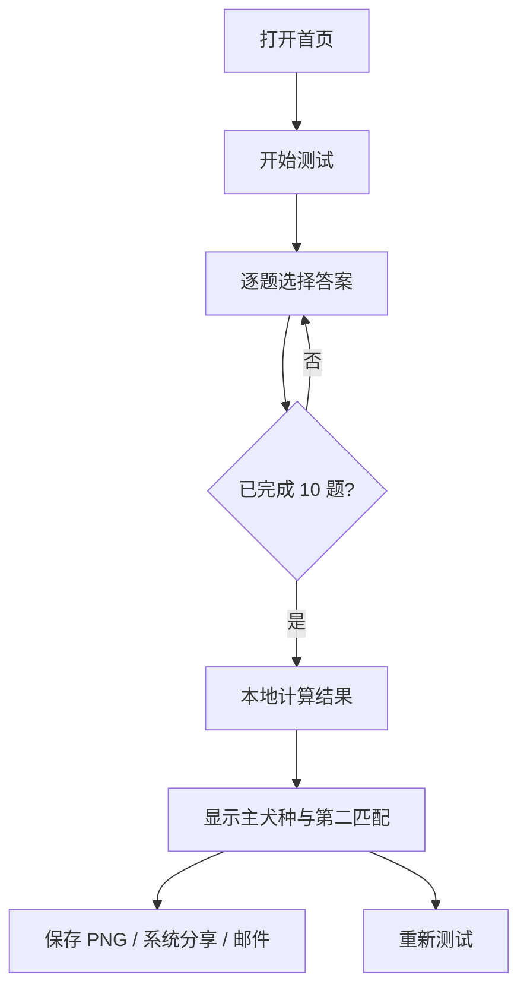

# PawMatch 趣味测试版

**产品与技术设计书 · MVP v0.1**  
**主题：如果你是狗狗，你会是哪种犬种？**

| 文档项 | 内容 |
|---|---|
| 面向对象 | 产品设计者、前端开发者、测试人员、内容维护者 |
| 产品定位 | 轻松、有梗、适合朋友间分享的人格趣味测试 |
| 首版技术 | Next.js App Router + TypeScript + 本地静态数据 |
| 首版边界 | 纯前端、无登录、无数据库、无服务端邮件 |
| 核心输出 | 主犬种、第二匹配犬种、人格文案、可下载 PNG 结果卡 |
| 预计题量 | 10 道单选题 |
| 预计结果 | 12 种犬种人格 |
| 预计完成时间 | 60～90 秒 |

> 本测试只用于娱乐，不代表真实犬种行为评估，也不用于判断用户适合饲养哪种狗。

---

# 1. 产品定义

## 1.1 产品目标

用户通过 10 道轻松的生活情境题，获得一个“人格犬种”结果。结果应当同时满足三个条件：

1. **有代入感**：描述中至少有两处能让用户觉得“很像我”。
2. **有娱乐性**：包含一个温和、可爱的缺点，不做负面人格评判。
3. **适合传播**：结果卡在手机屏幕中清晰，可保存为图片并通过社交软件或邮件发送。

## 1.2 MVP 成功标准

- 用户无需登录即可开始并完成测试。
- 手机端从首页到结果页不超过 90 秒。
- 10 道题每次只显示一道，支持上一题和进度显示。
- 相同答案在同一问卷版本下始终产生相同结果。
- 结果页展示主犬种、第二匹配犬种、3 个关键词、人格描述和“可爱的小缺点”。
- 用户可以把结果卡保存为 PNG。
- 支持 Web Share 时，可直接唤起手机系统分享面板。
- 不支持文件分享时，可以下载 PNG，并打开默认邮件应用。
- 网站部署后有公开 HTTPS URL，朋友无需安装应用即可访问。

## 1.3 当前版本明确不做

- “适合养什么狗”的严肃犬种推荐。
- 居住环境、预算、过敏、运动时间等饲养条件判断。
- 注册、登录、排行榜、评论和好友系统。
- 数据库、管理后台和答题历史云端保存。
- 网站服务器直接向收件人发送邮件。
- AI 动态生成题目或结果。
- 自动收集邮箱、姓名或完整答题记录。

## 1.4 后续扩展边界

严肃犬种选择功能作为独立的第二阶段入口开发。趣味版的页面组件可以复用，但评分数据和免责声明必须与严肃版分开，不能让用户误以为娱乐结果等于真实养犬建议。

---

# 2. 用户体验设计

## 2.1 页面结构

| 路由 | 页面 | 主要内容 |
|---|---|---|
| `/` | 首页 | 产品名、简短介绍、开始按钮、预计用时 |
| `/quiz` | 答题页 | 题目、4 个选项、进度、上一题/下一题 |
| `/result` | 结果页 | 主结果、第二匹配、结果卡、保存/分享/重测 |
| `/about` | 说明页 | 娱乐声明、隐私说明、版本号、图片来源 |

## 2.2 核心流程



## 2.3 交互原则

- 手机优先，主内容宽度建议不超过 `560px`。
- 选项整行可点击，点击后提供清晰的选中反馈。
- 选择答案后可自动进入下一题，但延迟约 200～300ms，避免误触造成“页面闪走”。
- 始终提供“上一题”；返回后保留已选答案。
- 未选择答案时不允许主动点击“下一题”。
- 进度显示为“3 / 10”，并配合进度条。
- 不用倒计时，不制造答题压力。
- 结果揭晓动画控制在 1 秒左右，并支持 `prefers-reduced-motion`。
- 文案使用中文首版；所有用户可见文案都从数据文件读取，为后续日语/英语版本预留结构。

## 2.4 视觉方向

- 关键词：可爱、明亮、轻松、有一点荒诞感。
- 建议色彩：奶油白背景 + 暖橙主色 + 深棕文字 + 少量蓝绿辅助色。
- 题卡采用大圆角和轻阴影；避免过度幼儿化。
- 每个犬种拥有一个主题色，但文本对比度需要满足 WCAG AA。
- 犬种图片必须使用自有、明确授权或可追踪许可的素材。

---

# 3. 功能需求

| ID | 功能 | 优先级 | 验收条件 |
|---|---|---:|---|
| F-01 | 开始测试 | P0 | 点击后进入第 1 题 |
| F-02 | 逐题作答 | P0 | 10 题均为必答，每题单选 |
| F-03 | 返回修改 | P0 | 返回上一题后答案仍被选中 |
| F-04 | 进度显示 | P0 | 题号与进度条同步 |
| F-05 | 本地评分 | P0 | 不调用后端，相同输入结果稳定 |
| F-06 | 主结果 | P0 | 显示犬种、3 个标签、描述、可爱缺点 |
| F-07 | 第二匹配 | P0 | 显示“你也有一点像……” |
| F-08 | PNG 保存 | P0 | 生成清晰的 1080×1350 PNG |
| F-09 | 系统分享 | P0 | 能力支持时分享 PNG 文件和文字 |
| F-10 | 邮件分享 | P0 | 打开邮件应用；无法附图时明确提示手动添加 |
| F-11 | 重新测试 | P0 | 清空本次答案并回到第 1 题 |
| F-12 | 刷新恢复 | P1 | 答题中刷新后可从当前进度恢复 |
| F-13 | 结果 URL | P1 | URL 可复现结果，但不包含完整答案 |
| F-14 | 复制文案 | P1 | 一键复制结果标题、短文和站点 URL |

## 3.1 首页

建议主文案：

> **如果你是狗狗，你会是哪种犬种？**  
> 10 道题，看看你是温暖的金毛、傲娇的柴犬，还是自带剧情的哈士奇。

按钮：`开始测试`  
辅助信息：`共 10 题 · 约 1 分钟 · 纯属娱乐`

## 3.2 答题页

必须包含：

- 当前进度。
- 题目文本。
- 4 个选项。
- 上一题按钮。
- 当前选中状态。
- 第 10 题完成后的“查看我的犬种”按钮。

离开页面时不弹出强制确认；答案可临时写入 `sessionStorage`，关闭标签页后自然失效。

## 3.3 结果页

页面信息顺序：

1. 揭晓标题：“你的狗格是——”
2. 主犬种名称和插图/照片。
3. 3 个人格关键词。
4. 80～120 字人格描述。
5. 一项“可爱的小缺点”。
6. 第二匹配：“你也有一点像 ××”。
7. 保存图片、分享、邮件、复制文案、重新测试。
8. 娱乐声明和站点链接。

---

# 4. 技术架构

## 4.1 架构结论

首版使用纯前端静态架构。题目、评分向量、犬种结果和文案全部进入 Git 版本管理；浏览器在本地计算结果。无需数据库、账号系统或 API 密钥。

| 层 | 职责 | 推荐实现 |
|---|---|---|
| 页面层 | 首页、答题、结果、说明 | Next.js App Router |
| UI 组件 | 题卡、选项、进度、结果卡、分享按钮 | React Client Components |
| 状态层 | 当前题号、答案、问卷版本 | `useReducer` + `sessionStorage` |
| 领域层 | 向量累计、标准化、距离计算、并列处理 | 纯 TypeScript 函数 |
| 数据层 | 问题、答案向量、犬种原型、结果文案 | TypeScript 静态对象 |
| 图片导出 | 将结果卡节点转换为 PNG | `html-to-image` 或同类前端库 |
| 分享层 | 文件分享、下载、邮件后备 | Web Share API + Blob + `mailto:` |
| 部署层 | HTTPS、CDN、公开 URL | Vercel |

## 4.2 数据流

1. 页面加载 `quiz.v1.ts` 和 `breedResults.v1.ts`。
2. 用户每次选择答案，reducer 以 `questionId` 保存 `optionId`。
3. 完成后，评分函数把 10 个答案的向量相加并标准化为 0～100。
4. 计算用户向量与 12 个犬种原型的加权距离。
5. 距离最小者为主结果，第二小者为第二匹配。
6. 结果只在浏览器保存；结果 URL 仅保存结果 ID 和版本，不保存完整答案。
7. 结果卡生成 PNG Blob，供下载或系统分享。

## 4.3 推荐目录结构

```text
app/
  page.tsx
  quiz/page.tsx
  result/page.tsx
  about/page.tsx
components/
  quiz/QuestionCard.tsx
  quiz/OptionButton.tsx
  quiz/ProgressBar.tsx
  result/ResultCard.tsx
  result/SecondaryMatch.tsx
  share/ShareActions.tsx
data/
  quiz.v1.ts
  breedResults.v1.ts
domain/
  scoring/calculatePersonality.ts
  scoring/distance.ts
  scoring/tieBreaker.ts
  result/createResultUrl.ts
hooks/
  useQuizState.ts
  useResultImage.ts
types/
  personality.ts
public/
  breeds/
tests/
  unit/scoring.test.ts
  component/QuestionCard.test.tsx
  e2e/personality-quiz.spec.ts
```

## 4.4 基础实现原则

| 原则 | 实现要求 |
|---|---|
| 配置驱动 | 增删题目、选项和犬种时，不修改页面组件 |
| 纯函数评分 | 评分函数不读取 DOM、不访问网络、不修改外部状态 |
| 稳定可复现 | 固定版本、固定权重、固定并列规则，不使用随机数 |
| 隐私最小化 | 不上传答案，不采集邮箱，不保存个人信息 |
| 渐进增强 | 分享 API 不可用时仍能下载 PNG 和复制文字 |
| 移动优先 | 从 360px 宽度开始设计，再扩展桌面布局 |
| 可访问性 | 键盘可操作、焦点可见、图片有替代文本、颜色不是唯一状态提示 |
| 内容友善 | 避免把某种人格描述为坏、笨、危险或不正常 |
| 版本化 | 问卷和犬种原型均包含 `version`，规则修改后递增版本 |

---

# 5. 数据模型

```ts
export type TraitKey =
  | 'sociability'   // 社交度
  | 'energy'        // 活动力
  | 'independence'  // 独立性
  | 'loyalty'       // 忠诚与照顾
  | 'curiosity'     // 好奇心
  | 'expression'    // 情绪表达
  | 'planning'      // 计划性
  | 'chaos';        // 即兴与混乱指数

export type TraitVector = Record<TraitKey, number>;

export type QuizOption = {
  id: string;
  text: string;
  vector: TraitVector;
};

export type QuizQuestion = {
  id: string;
  text: string;
  options: QuizOption[];
};

export type BreedResult = {
  id: string;
  name: string;
  color: string;
  imagePath: string;
  prototype: TraitVector; // 每维 0～100
  tags: [string, string, string];
  summary: string;
  cuteFlaw: string;
  shareText: string;
};

export type PersonalityResult = {
  quizVersion: '1.0';
  primaryBreedId: string;
  secondaryBreedId: string;
  userVector: TraitVector;
  primaryDistance: number;
  secondaryDistance: number;
};
```

---

# 6. 人格维度和评分规则

## 6.1 八个人格维度

| 维度 | 低分倾向 | 高分倾向 |
|---|---|---|
| 社交度 `sociability` | 慢热、小圈子 | 自来熟、喜欢人群 |
| 活动力 `energy` | 宅家、节奏舒缓 | 行动力强、喜欢活动 |
| 独立性 `independence` | 喜欢陪伴与协作 | 自主、有自己的节奏 |
| 忠诚度 `loyalty` | 随性、不爱承担角色 | 重感情、照顾与守护 |
| 好奇心 `curiosity` | 熟悉环境更安心 | 探索、尝试、追新鲜感 |
| 表达度 `expression` | 情绪内敛 | 热情、反应明显 |
| 计划性 `planning` | 随机应变 | 研究、安排、推进 |
| 混乱指数 `chaos` | 稳定、遵循常规 | 即兴、跳脱、制造剧情 |

这些维度只服务于娱乐型人格映射，不等同于心理测量量表。

## 6.2 计算步骤

每个选项为八个维度贡献 `0～3` 分。完成后：

```ts
normalizedTrait = Math.round((traitSum / traitPossibleMax) * 100);
```

为避免各题覆盖维度数量不完全相同时产生偏差，`traitPossibleMax` 必须按该维度在全部题目中理论可获得的最高分计算，不能统一写死为 30。

犬种匹配采用加权欧氏距离：

```ts
distance = Math.sqrt(
  sum(weight[key] * Math.pow(user[key] - breed[key], 2))
);
```

首版所有维度权重均为 `1`。经过朋友试玩后，可以在不修改题目 UI 的前提下调整权重。距离越小越匹配。

## 6.3 并列和稳定性规则

1. 优先选择距离更小的犬种。
2. 距离相同到小数点后 6 位时，比较第 10 题对应的“喜欢表达方式”与犬种原型距离。
3. 仍然相同时，按固定 `breedOrder` 排序。
4. 禁止使用 `Math.random()` 破坏可复现性。
5. 第二匹配不能与主结果属于同一 `breedId`。

固定顺序：

```ts
const breedOrder = [
  'golden-retriever',
  'labrador',
  'poodle',
  'border-collie',
  'shiba-inu',
  'husky',
  'samoyed',
  'german-shepherd',
  'greyhound',
  'corgi',
  'beagle',
  'french-bulldog',
] as const;
```

## 6.4 首版犬种原型

数值顺序为：`社交 / 活力 / 独立 / 忠诚 / 好奇 / 表达 / 计划 / 混乱`。

| 犬种结果 | 原型向量 | 核心人格 |
|---|---|---|
| 金毛寻回犬 | 90 / 70 / 25 / 85 / 60 / 85 / 45 / 35 | 温暖、友善、让人安心 |
| 拉布拉多 | 85 / 85 / 30 / 80 / 75 / 80 / 50 / 50 | 乐观、行动派、团队型 |
| 贵宾犬 | 65 / 60 / 55 / 65 / 80 / 60 / 85 / 25 | 聪明、敏锐、讲究 |
| 边境牧羊犬 | 55 / 90 / 50 / 80 / 85 / 45 / 95 / 20 | 高效、专注、战略型 |
| 柴犬 | 35 / 55 / 95 / 75 / 55 / 30 / 55 / 35 | 独立、克制、有原则 |
| 哈士奇 | 70 / 95 / 85 / 55 / 95 / 90 / 15 / 100 | 自由、即兴、剧情丰富 |
| 萨摩耶 | 90 / 75 / 40 / 70 / 65 / 95 / 35 / 55 | 明亮、爱热闹、有主见 |
| 德国牧羊犬 | 45 / 80 / 60 / 100 / 55 / 35 / 90 / 15 | 可靠、守护、执行力强 |
| 灵缇 | 35 / 30 / 70 / 65 / 35 / 25 / 45 / 15 | 安静、敏感、享受舒适 |
| 柯基 | 80 / 75 / 65 / 70 / 75 / 80 / 70 / 65 | 热闹、有主见、爱主持 |
| 比格犬 | 75 / 80 / 65 / 55 / 100 / 70 / 25 / 80 | 好奇、探索、容易跑题 |
| 法国斗牛犬 | 60 / 25 / 55 / 70 / 35 / 65 / 30 / 40 | 松弛、幽默、陪伴型 |

> 上表是人格角色设定，不是对真实犬种个体的科学判断。上线前应邀请至少 5～10 人盲测，观察结果分布是否过度集中于某一犬种。

---

# 7. 正式问卷 v1.0

下列“向量增量”顺序同样为：`社交 / 活力 / 独立 / 忠诚 / 好奇 / 表达 / 计划 / 混乱`。该数据只用于实现，不向普通用户显示。

## Q1. 终于到周末，你最想怎么过？

| 选项 | 用户文案 | 向量增量 |
|---|---|---|
| A | 窝在沙发看电影，谁也别叫我 | 0 / 0 / 3 / 1 / 0 / 0 / 1 / 0 |
| B | 和熟悉的朋友吃饭聊天 | 2 / 1 / 1 / 2 / 1 / 2 / 1 / 0 |
| C | 去公园散步、运动或爬山 | 1 / 3 / 1 / 1 / 2 / 1 / 1 / 0 |
| D | 临时出发去陌生地方探险 | 1 / 3 / 2 / 0 / 3 / 2 / 0 / 3 |

## Q2. 进入一个全是陌生人的聚会，你通常会？

| 选项 | 用户文案 | 向量增量 |
|---|---|---|
| A | 十分钟后已经和大家聊熟 | 3 / 2 / 0 / 1 / 2 / 3 / 0 / 2 |
| B | 先找一个看起来友善的人说话 | 2 / 1 / 1 / 2 / 1 / 1 / 1 / 0 |
| C | 安静观察，熟了才打开 | 0 / 0 / 2 / 1 / 1 / 0 / 2 / 0 |
| D | 站在朋友旁边，顺便默默判断所有人 | 0 / 0 / 3 / 2 / 1 / 0 / 1 / 1 |

## Q3. 面对一个新任务，你的第一反应是？

| 选项 | 用户文案 | 向量增量 |
|---|---|---|
| A | 直接上手，边做边学 | 1 / 3 / 2 / 0 / 3 / 2 / 0 / 2 |
| B | 先研究清楚，再制定计划 | 0 / 1 / 2 / 1 / 2 / 0 / 3 / 0 |
| C | 拉上别人一起做更有动力 | 3 / 2 / 0 / 2 / 1 / 2 / 1 / 1 |
| D | 先看我有没有兴趣，没有就放着 | 0 / 0 / 3 / 0 / 1 / 1 / 0 / 2 |

## Q4. 朋友临时取消约定，你会？

| 选项 | 用户文案 | 向量增量 |
|---|---|---|
| A | 马上找下一场活动 | 3 / 3 / 1 / 0 / 2 / 2 / 0 / 2 |
| B | 有点失落，但很快安排自己的事 | 1 / 1 / 2 / 1 / 1 / 1 / 2 / 0 |
| C | 表面没事，心里会默默记住 | 0 / 0 / 2 / 3 / 0 / 0 / 1 / 0 |
| D | 太好了，我正想独处 | 0 / 0 / 3 / 0 / 1 / 1 / 0 / 1 |

## Q5. 朋友最常用哪个词形容你？

| 选项 | 用户文案 | 向量增量 |
|---|---|---|
| A | 热情开心果 | 3 / 2 / 0 / 1 / 1 / 3 / 0 / 2 |
| B | 靠谱又温柔 | 2 / 1 / 0 / 3 / 0 / 2 / 2 / 0 |
| C | 聪明又较真 | 0 / 1 / 2 / 1 / 2 / 0 / 3 / 0 |
| D | 独立有个性 | 0 / 1 / 3 / 1 / 1 / 1 / 1 / 1 |

## Q6. 你迷路时通常怎么处理？

| 选项 | 用户文案 | 向量增量 |
|---|---|---|
| A | 自信地继续走，剧情更精彩 | 1 / 2 / 2 / 0 / 3 / 2 / 0 / 3 |
| B | 打开地图，快速修正路线 | 0 / 1 / 2 / 1 / 1 / 0 / 3 / 0 |
| C | 找人问路，顺便认识新朋友 | 3 / 1 / 0 / 1 / 2 / 3 / 1 / 1 |
| D | 我没迷路，只是选择了另一条路线 | 0 / 1 / 3 / 0 / 2 / 1 / 0 / 2 |

## Q7. 团队突然陷入混乱时，你更像？

| 选项 | 用户文案 | 向量增量 |
|---|---|---|
| A | 活跃气氛，让大家先别慌 | 3 / 2 / 0 / 2 / 0 / 3 / 0 / 1 |
| B | 整理任务，把事情一步步推进 | 1 / 2 / 1 / 3 / 0 / 0 / 3 / 0 |
| C | 先看看谁状态不好，并照顾他 | 2 / 1 / 0 / 3 / 0 / 2 / 1 / 0 |
| D | 指出真正的问题，即使别人不爱听 | 0 / 1 / 3 / 2 / 1 / 1 / 2 / 0 |

## Q8. 如果能选一种超能力，你想要？

| 选项 | 用户文案 | 向量增量 |
|---|---|---|
| A | 读心术：马上知道大家在想什么 | 2 / 0 / 0 / 2 / 2 / 2 / 1 / 0 |
| B | 分身术：同时完成所有事情 | 1 / 3 / 1 / 2 / 1 / 1 / 3 / 1 |
| C | 瞬间移动：随时去任何地方 | 1 / 3 / 2 / 0 / 3 / 2 / 0 / 3 |
| D | 超级感官：发现别人忽略的细节 | 0 / 1 / 2 / 1 / 3 / 0 / 2 / 0 |

## Q9. 面对规则，你更接近？

| 选项 | 用户文案 | 向量增量 |
|---|---|---|
| A | 合理就遵守，不合理就讨论 | 2 / 1 / 2 / 1 / 1 / 2 / 2 / 0 |
| B | 规则让我安心，我会认真执行 | 0 / 1 / 0 / 3 / 0 / 0 / 3 / 0 |
| C | 先试试能不能偷偷绕过去 | 1 / 2 / 2 / 0 / 2 / 2 / 0 / 3 |
| D | 我有自己的规则，谢谢 | 0 / 1 / 3 / 1 / 1 / 1 / 0 / 2 |

## Q10. 你通常怎样表达喜欢？

| 选项 | 用户文案 | 向量增量 |
|---|---|---|
| A | 热情说出来，并主动靠近 | 3 / 2 / 0 / 2 / 1 / 3 / 0 / 1 |
| B | 默默记住并照顾对方的需要 | 1 / 1 / 0 / 3 / 1 / 1 / 2 / 0 |
| C | 一起做有趣的事，制造回忆 | 2 / 3 / 1 / 2 / 3 / 2 / 0 / 2 |
| D | 不总说出口，但会一直留在身边 | 0 / 0 / 3 / 3 / 0 / 0 / 1 / 0 |

---

# 8. 十二种结果文案

## 8.1 金毛寻回犬

- 标签：`温暖` `友善` `安心感`
- 描述：你很容易让人放下戒心。你愿意听朋友说话，也会自然地把落单的人拉进圈子。你不是没有情绪，只是常常先照顾气氛和别人的感受。对你来说，喜欢一个人就是让对方知道：有你在，事情不会太糟。
- 可爱的小缺点：有时太想让所有人开心，忘了自己也可以先休息。
- 分享标题：`我是金毛型人格：朋友群里的安心充电站。`

## 8.2 拉布拉多

- 标签：`乐观` `行动派` `团队感`
- 描述：你倾向先行动，再边走边修正。遇到新任务时，你的能量往往会感染身边的人。你重视合作，也不介意在关键时刻多做一点。你给人的感觉直接、可靠、没有太多弯弯绕绕，是团队里最容易把“要不试试”变成“已经做完”的人。
- 可爱的小缺点：兴奋起来容易答应太多事，之后才发现自己的行程已经塞满。
- 分享标题：`我是拉布拉多型人格：乐观的行动派。`

## 8.3 贵宾犬

- 标签：`聪明` `敏锐` `有品位`
- 描述：你观察得快，学得也快，常能注意到别人忽略的小细节。你对环境、表达和做事方式都有自己的标准，不喜欢粗糙地应付。你能社交，也能独立完成事情；真正吸引你的不是热闹本身，而是有趣、漂亮或值得研究的东西。
- 可爱的小缺点：标准一高，就可能在一个小细节上纠结得比所有人都久。
- 分享标题：`我是贵宾型人格：聪明、敏锐，还有一点讲究。`

## 8.4 边境牧羊犬

- 标签：`高效` `专注` `战略家`
- 描述：当别人还在讨论从哪里开始，你已经悄悄整理好了步骤。你喜欢理解系统、发现规律，并把混乱变成可执行的计划。对真正感兴趣的事情，你的专注和学习速度很惊人。你表达关心的方式，常常是解决问题和把事情可靠地推进。
- 可爱的小缺点：看到低效率时，很难忍住不在脑中替所有人重新排流程。
- 分享标题：`我是边牧型人格：会把混乱自动整理成清单。`

## 8.5 柴犬

- 标签：`独立` `克制` `有原则`
- 描述：你有自己的节奏和边界，不会为了融入而随便改变立场。面对陌生人时你可能慢热，但认定一个人后，忠诚会体现在长期而稳定的行动里。你不喜欢被命令，也不需要时时刻刻黏在一起；真正舒服的关系，是彼此尊重又一直在身边。
- 可爱的小缺点：嘴上说“都可以”，心里其实早已有一个唯一正确答案。
- 分享标题：`我是柴犬型人格：不讨好，但认定了就很长情。`

## 8.6 哈士奇

- 标签：`自由` `冒险` `剧情体质`
- 描述：你的世界很难无聊，因为一个普通计划也可能被你走成全新支线。你好奇、敢试、讨厌被过多规则限制。别人可能猜不到你下一步要做什么，但也正因为如此，和你在一起总有新鲜感。你的真诚通常来得直接又热烈，不太适合藏着掖着。
- 可爱的小缺点：行动速度偶尔超过了计划速度，回头才发现路线好像不太对。
- 分享标题：`我是哈士奇型人格：自由灵魂，自带剧情。`

## 8.7 萨摩耶

- 标签：`明亮` `热情` `聚会磁场`
- 描述：你很会把轻松和快乐带进一个空间，也愿意主动靠近别人。你的外表可能让人觉得温和好说话，但其实你有明确的偏好，也很希望自己的情绪和用心得到回应。你享受一起庆祝、分享和制造回忆，是朋友圈里让大家重新聚起来的人。
- 可爱的小缺点：看起来一直在微笑，心里却可能正在认真等待一句“你今天也很棒”。
- 分享标题：`我是萨摩耶型人格：负责让大家重新笑起来。`

## 8.8 德国牧羊犬

- 标签：`可靠` `守护` `执行力`
- 描述：你对承诺很认真，遇到问题时会本能地站出来处理。你不一定是人群中最热闹的那个，却经常是最让人放心的那个。你习惯观察风险、安排步骤，并保护自己在意的人。你表达感情的方式很实际：出现、承担，然后把事情稳稳接住。
- 可爱的小缺点：责任心一上线，就容易把本来不属于自己的任务也一起扛走。
- 分享标题：`我是德牧型人格：不多说，但会把事情接住。`

## 8.9 灵缇

- 标签：`安静` `敏感` `松弛感`
- 描述：你并不缺乏行动力，只是不愿把能量浪费在无意义的喧闹上。你享受舒服、熟悉、有安全感的空间，也能捕捉到细微的气氛变化。对外界你可能显得优雅克制，对信任的人却很柔软。你知道什么时候冲刺，也知道什么时候该躺平。
- 可爱的小缺点：如果沙发足够舒服，再好的计划也可能被推迟五分钟——然后再五分钟。
- 分享标题：`我是灵缇型人格：该冲刺时冲刺，该躺时绝不勉强。`

## 8.10 柯基

- 标签：`热闹` `主见` `小队长`
- 描述：你很有存在感，能迅速参与话题，也常常自然地开始组织局面。你喜欢和人在一起，但并不代表你没有自己的意见；恰恰相反，你经常知道大家下一步应该做什么。你把关心表现为参与、提醒和推动，是个子不重要、气场必须到位的小队长。
- 可爱的小缺点：本来只想提一个建议，最后不知不觉成了整个活动的总导演。
- 分享标题：`我是柯基型人格：个子可以小，主场必须由我主持。`

## 8.11 比格犬

- 标签：`好奇` `探索` `兴趣导航`
- 描述：你对新鲜线索几乎没有抵抗力。一个有趣的问题、一家没去过的小店，甚至路边突然出现的声音，都可能把你带进新的方向。你喜欢亲自体验，不满足于只听别人描述。你的热情真实又有感染力，只是注意力有时会跟着最新的兴趣先跑一步。
- 可爱的小缺点：原本只是查一个问题，回过神时已经打开了十八个标签页。
- 分享标题：`我是比格型人格：人生靠好奇心导航。`

## 8.12 法国斗牛犬

- 标签：`松弛` `幽默` `陪伴感`
- 描述：你不迷恋忙碌，也不需要靠宏大计划证明自己。舒服、真诚、有趣的人和事才值得投入。你很会用轻松的方式化解尴尬，和你待在一起往往不需要费力找话题。你喜欢稳定的陪伴，同时保留一点“今天就别折腾了”的生活智慧。
- 可爱的小缺点：对麻烦的预警系统过于灵敏，一察觉复杂就想先坐下来再说。
- 分享标题：`我是法斗型人格：松弛不是懒，是生活智慧。`

---

# 9. 结果卡、截图保存与分享

## 9.1 结果卡规格

导出尺寸建议为 `1080 × 1350px`（4:5），适合手机保存和多数社交平台展示。

结果卡包含：

- PawMatch 标识。
- “如果我是狗狗，我是……”标题。
- 主犬种名称和图片。
- 3 个关键词。
- 60～90 字的精简描述。
- 可爱的小缺点。
- 网站短 URL 或二维码。
- “纯属娱乐”小字。

结果卡不包含：

- 用户的完整答案。
- 邮箱地址或其他个人信息。
- 第二匹配的长文，以免卡片过密。

## 9.2 PNG 生成

建议流程：

1. 使用专门的 `ResultCard` DOM 节点，屏幕预览与导出共用同一份内容。
2. 犬种图片放在 `public/breeds/`，避免跨域图片污染 Canvas。
3. 生成前等待 `document.fonts.ready` 和图片加载完成。
4. 使用 `toBlob()` 或等价 API 输出 PNG Blob。
5. 下载文件名：`pawmatch-{breedId}-result.png`。
6. 导出失败时显示：“生成图片失败，请使用浏览器截图，或复制结果文字。”

## 9.3 系统分享

```ts
const file = new File([blob], 'pawmatch-result.png', {
  type: 'image/png',
});

if (
  navigator.share &&
  navigator.canShare?.({ files: [file] })
) {
  await navigator.share({
    title: '我的 PawMatch 结果',
    text: result.shareText,
    files: [file],
    url: resultUrl,
  });
}
```

注意：

- Web Share 需要 HTTPS 或 `localhost`。
- 分享必须由用户点击直接触发。
- 不同设备显示的分享目标不同，网站不能保证某个邮件 App 一定出现。
- 用户主动取消分享不显示错误警告。

## 9.4 邮件分享的首版定义

浏览器的普通 `mailto:` 不能可靠地自动附加 PNG。因此“发到任意邮箱”采用以下降级设计：

1. 移动端支持文件分享时，调用系统分享面板，由用户选择 Gmail、Outlook、Apple Mail 等应用。
2. 不支持时，先下载 PNG，再打开带主题和正文的 `mailto:`。
3. 页面提示：“图片已保存，请在邮件中手动添加附件。”

```ts
const subject = encodeURIComponent('看看我是什么狗狗人格');
const body = encodeURIComponent(`${result.shareText}\n${resultUrl}`);
window.location.href = `mailto:?subject=${subject}&body=${body}`;
```

首版不要求用户在网站内输入收件人地址，也不设置邮件服务器。若未来要求真正“一键发送到任意邮箱并自动附图”，需要新增后端邮件服务、发件域名验证、限流、验证码、滥用防护和隐私说明。

## 9.5 可复现结果 URL

建议格式：

```text
https://pawmatch.example/result?breed=shiba-inu&second=poodle&v=1
```

URL 只用于展示结果，不代表重新计算。参数必须经过白名单校验；无效参数返回首页或通用错误页。

---

# 10. 开发者指南

## 10.1 环境要求

- Node.js：使用当前项目固定的 LTS 版本，并写入 `.nvmrc` 和 `package.json#engines`。
- 包管理器：首版统一使用 npm，提交 `package-lock.json`。
- 浏览器：最新版 Chrome/Edge；分享功能还需在真实 iPhone/Android 上验证。
- 环境变量：MVP 不需要数据库、邮件密钥或第三方 API Key。

## 10.2 创建项目

```bash
npx create-next-app@latest pawmatch \
  --typescript \
  --eslint \
  --app \
  --src-dir=false \
  --import-alias='@/*'

cd pawmatch
npm install html-to-image
npm run dev
```

浏览器打开：

```text
http://localhost:3000
```

如果 Windows PowerShell 因执行策略阻止 `npm.ps1`，可以在当前终端改用：

```powershell
npm.cmd install
npm.cmd run dev
```

这样不要求修改整台电脑的永久执行策略。

## 10.3 推荐 npm scripts

```json
{
  "scripts": {
    "dev": "next dev",
    "build": "next build",
    "start": "next start",
    "lint": "eslint .",
    "typecheck": "tsc --noEmit",
    "test": "vitest run",
    "test:watch": "vitest",
    "test:e2e": "playwright test"
  }
}
```

Vitest、Testing Library 和 Playwright 可在页面流程稳定后加入，避免项目创建第一天被测试配置拖慢。

## 10.4 调试方法

### 评分结果不符合预期

- 为评分函数输出每个维度的累计值、理论最大值、标准化值和各犬种距离。
- 先写固定答案夹具，不要只靠手动点击复现。
- 检查数据键名是否拼错、问题是否重复计分、版本是否一致。
- 用分布测试统计一批随机答案的结果频率；若某犬种占比异常高，检查原型向量或题目覆盖。

推荐仅在开发环境显示调试表：

```ts
if (process.env.NODE_ENV === 'development') {
  console.table({ userVector, distances });
}
```

### 答题跳转或答案丢失

- React DevTools 检查 reducer 的 `currentQuestionIndex` 和 `answers`。
- 答案必须按稳定的 `questionId` 保存，不按数组位置长期绑定。
- `sessionStorage` 数据应包含 `quizVersion`；版本不一致时清除旧数据。

### PNG 缺字或缺图

- 等待 `document.fonts.ready`。
- 图片使用同源本地资源。
- 为结果卡设置固定导出宽高，避免依赖当前手机屏幕尺寸。
- 捕获图片生成异常并保留“复制文字”和“浏览器截图”后备。

### 分享按钮没有反应

- 确认页面运行在 HTTPS 或 localhost。
- 确认 API 是在真实点击事件中直接调用。
- 分别记录 `navigator.share`、`navigator.canShare` 和文件支持结果。
- 桌面浏览器不支持文件分享属于正常情况，应走下载分支。

---

# 11. 测试与验收

## 11.1 单元测试

| ID | 场景 | 预期 |
|---|---|---|
| UT-01 | 所有题选择相同固定答案 | 每次得到同一主结果和第二结果 |
| UT-02 | 修改其中一个答案 | 仅对应维度和距离发生合理变化 |
| UT-03 | 两犬种距离并列 | 按第 10 题和固定顺序稳定处理 |
| UT-04 | 少于 10 个答案 | 返回 incomplete，不计算结果 |
| UT-05 | 出现未知题目或选项 ID | 返回受控错误，不静默计零分 |
| UT-06 | 所有标准化维度 | 均处于 0～100 范围 |
| UT-07 | 主结果与第二结果 | `breedId` 不相同 |
| UT-08 | 结果 URL 非法 ID | 被白名单校验拒绝 |

## 11.2 组件与端到端测试

| ID | 场景 | 预期 |
|---|---|---|
| E2E-01 | 从首页完成 10 题 | 正常进入结果页 |
| E2E-02 | 第 5 题返回第 4 题 | 原答案仍然存在且可修改 |
| E2E-03 | 答题中刷新 | 恢复版本一致的当前进度 |
| E2E-04 | 点击重新测试 | 清空答案并返回第 1 题 |
| E2E-05 | 支持文件分享 | 分享参数包含 PNG File |
| E2E-06 | 不支持文件分享 | 下载 PNG，并提供邮件后备 |
| E2E-07 | PNG 导出失败 | 显示截图/复制文字提示 |
| E2E-08 | 直接打开合法结果 URL | 可展示对应结果 |

## 11.3 视觉与可访问性验收

- 在 `360×800`、`390×844`、`768×1024`、`1440×900` 下无横向溢出。
- 选项按钮最小触控高度为 44px。
- Tab 可以遍历所有交互元素，Enter/Space 可以选择答案。
- 选中状态不仅依赖颜色，还包含图标或边框变化。
- 图片加载失败时仍能从文字理解结果。
- 开启减少动画后，结果页不播放大幅移动或闪烁动画。
- 200% 浏览器缩放下仍可完成测试。

## 11.4 内容试玩验收

第一轮邀请 5～10 位朋友试玩，记录：

- 是否能在 90 秒左右完成。
- 哪道题最难选、最无聊或意思重复。
- 结果是否“有一点准，又不会太严肃”。
- 结果文案是否存在冒犯、性别刻板印象或负面标签。
- 是否愿意保存或发送结果。
- 12 个犬种结果分布是否明显失衡。

建议上线门槛：没有单一犬种在小规模随机组合模拟中占据异常比例；真人试玩中至少 70% 的人认为主结果“基本符合”或“有趣到愿意分享”。该比例只是产品迭代指标，不是心理测验准确率。

---

# 12. 部署和发布

## 12.1 Vercel 部署

1. 将项目提交到 GitHub。
2. 在 Vercel 导入仓库。
3. Framework Preset 选择 Next.js。
4. 首版无需配置环境变量。
5. 部署完成后获得公开 HTTPS URL。
6. 把 URL 发给朋友，即可直接用浏览器打开。

建议分支策略：

- `main`：生产环境。
- 功能分支：开发与修改。
- Pull Request：自动生成预览 URL，先在手机测试再合并。

## 12.2 上线检查清单

- [ ] 10 道题文字、顺序和选项已确认。
- [ ] 12 种犬种均有完整文案、图片和主题色。
- [ ] 图片版权与来源已记录。
- [ ] 评分单元测试通过。
- [ ] `npm run lint` 通过。
- [ ] `npm run typecheck` 通过。
- [ ] `npm run build` 通过。
- [ ] iPhone Safari 完成一次真机测试。
- [ ] Android Chrome 完成一次真机测试。
- [ ] 桌面 Chrome/Edge 验证下载后备。
- [ ] PNG 中字体、图片和二维码清晰。
- [ ] 邮件按钮明确提示附件限制。
- [ ] `/about` 包含娱乐声明和隐私说明。
- [ ] 404 页面和非法结果参数有安全后备。

## 12.3 隐私说明建议文本

> PawMatch 趣味测试的答案和计算均在你的浏览器中完成。当前版本不要求登录，不收集姓名、邮箱或完整答题记录。使用系统分享或邮件功能时，具体数据处理由你选择的应用负责。

## 12.4 娱乐声明建议文本

> 本测试为娱乐内容，犬种结果是人格化创作，不代表对真实犬种、犬只个体或用户心理特征的专业判断。

---

# 13. 迭代计划

## v0.1：可玩的核心版本

- 首页、10 题、12 个结果。
- 本地评分。
- 结果页和重新测试。
- PNG 保存、系统分享、邮件后备。
- Vercel 公开 URL。

## v0.2：分享与内容优化

- 根据试玩结果调整题目和原型向量。
- 更丰富的结果插画与轻动画。
- 分享结果 URL 和二维码。
- 日语、英语版本。
- 可选匿名统计；只有在提供清晰说明并取得同意后启用。

## v0.3：严肃犬种选择功能

- 首页增加第二入口“哪种狗狗适合我”。
- 独立问卷、独立评分和专业免责声明。
- 居住许可、运动、独处、预算、儿童/宠物、护理和健康风险等维度。
- 犬种数据来源和审核流程。

---

# 14. 开发启动顺序

建议按以下顺序实现，避免先陷入图片和分享兼容问题：

1. 创建 Next.js 项目和基础路由。
2. 定义类型、10 道题和 12 个犬种数据。
3. 编写评分纯函数及单元测试。
4. 完成答题状态和页面流程。
5. 完成结果页和结果 URL。
6. 加入犬种图片与视觉样式。
7. 实现 PNG 导出。
8. 实现系统分享、下载和邮件后备。
9. 完成手机端与可访问性检查。
10. 部署预览版，邀请朋友试玩并调整分布。

完成第 5 步时，网站已经是一个可以内部试玩的功能版本；图片分享和精细视觉可以随后补上。
